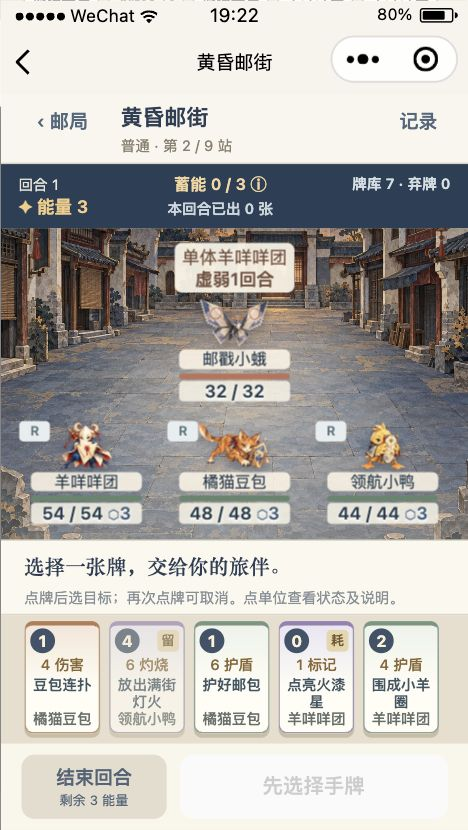
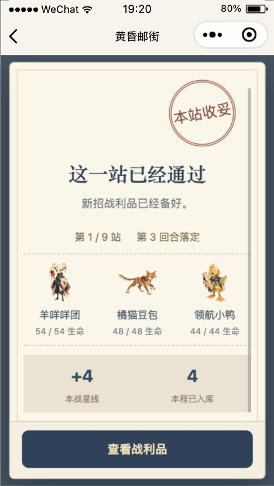

# 配乐、Boss 节奏与战术卡组验收

本轮完成六首配乐重编、Boss 节拍放慢、持续战后回执，以及 12 张新通用战术牌。原生实玩使用三位初始 1 级 R 伙伴通关黄昏邮街，并实测另一套起手及全队倒下。

## 实现结果

- 6 首原创音乐改为木质拨弦、柔和持续和声和带休止的乐句；地区音乐为 24 秒。胜利音 1.8 秒、失败音 1.6 秒。没有引入第三方歌曲或录音，来源与参数见 [音频台账](../../audio/ASSET_LEDGER.md)。
- Boss 每次行动为 800ms 蓄势、1200ms 命中读数、300ms 间歇；移除叠加在 Boss 外层动作上的快速内层摆动。单体/全体依据实际规则目标，掉血、护盾、治疗分别显示。
- 普通胜利、精英胜利、最终胜利和失败采用纸张展开、邮戳落定、队伍与收获依次出现的回执，约 1.35 秒完成呈现，玩家确认前不会自动关闭。奖励在演出之前保存；最后一击保留命中音，结算音在回执出现时播放。
- 牌库由 62 张扩至 74 张，加入蓄能、消耗、保留和出牌次序条件。出发前可选稳妥出发、加急接力、灯火储备；后两套只替换三张基础攻击，仍为 12 张起手。战斗工具条显示全队蓄能及已出牌数，点击直达说明。
- 10 项玩法说明涵盖新机制与原有回响、标记、弱化、灼烧、反击、留盾。费用与伤害在小屏分行；消耗/保留有卡面标识，卡牌详情显示减费后的实际费用与原费。
- 旧 v2 活动存档缺少新字段时按经典起手、零蓄能继续；战术名称与起手卡牌不一致会拒绝损坏存档。细节见 [玩法契约](../../adventure/CONTRACT.md)。

## 本地验证

- `npm test`：173/173 通过，无跳过。
- `node tests/claw-wxss.test.js --native`：15 份实际 WXSS 编译通过，确认原生编译器会拒绝已知非法通配选择器。
- `node scripts/check-package-budget.js`：主包 1,762,432 B（1.681 MiB），所有包低于项目 1.9 MiB 阈值。
- 独立规则复核发现并确认修复两项问题：战后蓄能残留导致奖励卡费用错误，以及战术名称与初始卡牌不匹配。24 组新牌基础/升级预览一致性、3600 组奖励抽样及 200 个种子的蓄能清零复核记录见 [独立复核](logs/rules-review.md)。该文件为审查记录，未冒充原始执行日志。

## 原生实玩与页面验收

微信开发者工具 Stable 2.02.2608040，基础库 3.17.0。通过真实节点执行点击、选目标、确认、切换、滚动与关闭；没有调用游戏方法代替点击，没有注入卡牌、余额、生命或随机种子。

| 场景 | 原生检查 | 证据 |
| --- | ---: | --- |
| 01-邮路实玩 | 112 项通过，按指定节点暂停 | [报告](01-邮路实玩/report.json) |
| 02-Boss逐拍录制 | 29 项通过 | [报告](02-Boss逐拍录制/report.json) |
| 03-说明390 | 16 项通过 | [报告](03-说明390/report.json) |
| 04-说明430 | 16 项通过 | [报告](04-说明430/report.json) |
| 05-首领通关 | 34 项通过 | [报告](05-首领通关/report.json) |
| 06-最终回执430 | 7 项通过 | [报告](06-最终回执430/report.json) |
| 07-最终回执320 | 7 项通过 | [报告](07-最终回执320/report.json) |
| 08-灯火储备首战 | 29 项通过 | [报告](08-灯火储备首战/report.json) |
| 09-小屏战后回执 | 7 项通过 | [报告](09-小屏战后回执/report.json) |
| 10-小屏卡面终验 | 18 项通过 | [报告](10-小屏卡面终验/report.json) |
| 11-全队倒下 | 49 项通过 | [报告](11-全队倒下/report.json) |
| 12-失败回执320 | 7 项通过 | [报告](12-失败回执320/report.json) |
| 13-音频原生 | 22 项通过 | [报告](13-音频原生/report.json) |

- 加急接力先经 61 个正常 UI 动作抵达 Boss；录制单体/全体技能的 3 个敌方回合后，继续 18 个动作打赢两阶段 Boss。最终 9/9 站、46 星线、4 邮票，三位伙伴存活。真实 4 费终结牌多次以 3 费打出，0 费过牌按消耗规则退出本战牌堆。
- 灯火储备在 320 宽度打赢首战，获得 4 星线；随后通过只结束回合触发全队倒下。失败后全局仍有 50 星线、10 邮票，永久伙伴不变；确认回执不再发放奖励。
- 新配乐在城镇、来信页面出现真实播放回调且播放时间前进；Boss 战也读到当前 Boss 曲目正在播放。22 个本地 MP3 均通过独立原生播放/解码探针。探针不代表在本轮实际打过三地 Boss。
- 320/390/430 覆盖战斗工具条、玩法说明、滚动与关闭；320/430 覆盖结果回执，320 另覆盖费用/伤害分行和卡牌持有者不裁切。独立静态视觉复核未发现新的遮挡问题。
- 关闭开发者工具并同步修订代码、重新打开后，实际存档和 RNG 完全一致。最终窗口恢复 390 宽度并展示新战术选择；展示操作不修改存档。

## 预览

[Boss 单体实录](logs/boss-single.mp4) · [Boss 群体实录](logs/boss-group.mp4)（录制只含画面，没有音轨）

## 本轮发现并修复

1. CLI 的 `getData(null)` 返回空对象，首版验收脚本误认为回执存在。改为检查 `visible`，按真实存档接续；这不是发奖或游戏状态故障。
2. 微信默认 mini 按钮规则覆盖了蓄能栏样式。提高容器选择器优先级并固定 44px 高度，三种宽度均实测通过。
3. 邮戳旋转后的真实边界仍触及标题，按原生坐标增加独立留白到 100px；最终 320/430 回执标题无重叠。
4. 320 小屏隐藏卡图后，费用圆标压住效果摘要。现在两者分行，持有者仍完整可见。
修复前的截图/失败报告保留在 `修复前记录/`；首领通关原始截图含修订前的邮戳留白，最终几何和排版结论以 06/07/09/10/12 的复验为准。

## 项目与验证边界

- 源码：`/Users/maizi/AI-Jobs/Projects/dusk-card-miniapp`。
- 实玩副本：`/var/folders/_4/8v6tx5gx30qgb8l4648rn5tr0000gn/T/dusk-card-acceptance-cAIGWF`。
- 使用原有独立测试 AppID `wx36c7c6b8b54e63c9`，副本存档 KEY 带验收目录后缀；不访问原 Love Diary 存档。
- 源码与副本 464 个应用文件一致，只有隔离存档 KEY 和项目注册配置的预期差异，见 [一致性核对](logs/source-copy-parity.json)。
- 每组最终原生验收的 CLI console error 筛选均为空。本轮原生窗口曾显示基础库灰度、资源预加载和 SDK worker 警告，Boss 录屏中可见；末次 CLI 日志缓冲保留在 `logs/console-full-raw.json`，不将它视作整个开发者工具的警告清零。
- 包体结论来自项目预算脚本；没有把它等同于微信代码质量面板的所有检查通过。
- 本轮没有生成新手机二维码、上传、发布或推送。模拟器播放回调不等于手机可听，手机实际音色、扬声器和性能仍需新预览实机确认。
- 页面标注的 10–15 分钟为设计目标；本轮 CLI 调用节流、截图和录像耗时不作为真人游玩时长。
- 旧最终回执没有保存队伍/回合快照时，重新打开只展示已存统计；不会借用当前队伍伪造历史信息。
